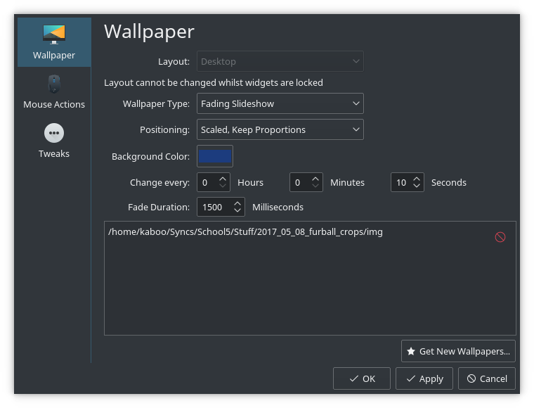

 
Hi!

KDE for a long time had a slideshow wallpaper
for the desktop background where you can specify
a folder of images and your wallpaper will change
periodically.  Plasma 5 also has this feature.  

There are two time durations that should be of
interest to you: the interval between wallpaper
rotations, and the crossfade duration.  Plasma 5 
allows you to control the interval between, but 
it does not directly allow you to control the 
crossfade time.

This tiny github repository starts with the
default slideshow wallpaper, located probably at
`/usr/share/plasma/wallpapers/org.kde.slideshow`,
and adds a few changes to expose the crossfade
duration in the gui.  The end result will look
like this.

In order to use this, copy the entire folder
`org.kde.slideshow_fade` to 
`/usr/share/plasma/wallpapers/` and then change
your wallpaper type to Fading Slideshow.
